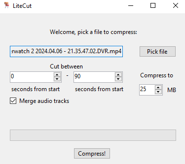

# LiteCut

## You *NEED* ffmpeg to use LiteCut.  The fastest way to install that is to use `winget install ffmpeg`.

# [Download LiteCut here!](https://github.com/gotimo2/LiteCut/releases)

A quick tool for cutting and compressing video down to a specified size, with the ability to choose where to cut and merge audio tracks using ffmpeg.

---- 

When you run the file, LiteCut will add itself to your "open with..." menu in Windows, so you can quickly start it from any .mp4 file. If you move LiteCut, where that option links to will be updated as soon as you run it again!
